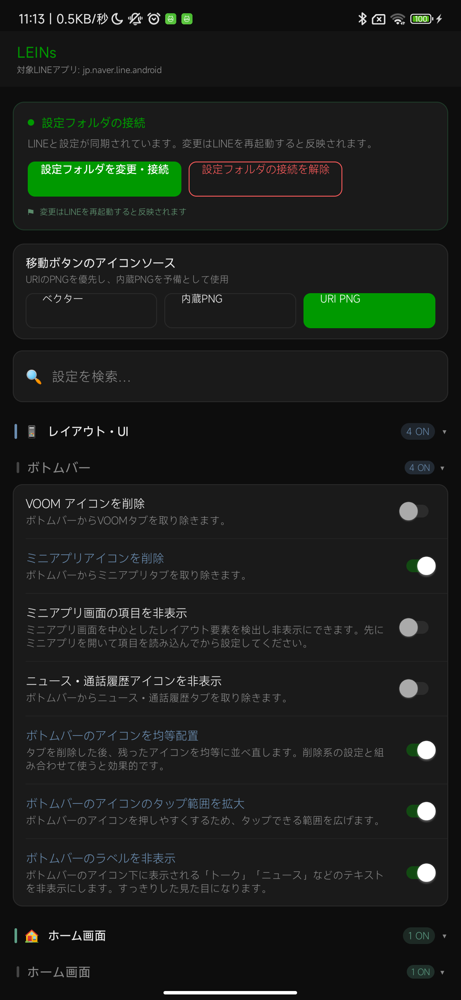

# はじめてのLEINs

[ホームへ戻る](../index.html) / [設定画面の使い方](settings-ui.md) / [用語集](glossary.md)

このページは、LEINsを初めて使う人向けの最短ガイドです。細かい機能を探す前に、全体の流れだけ確認してください。

## LEINsでできること

LEINsは、LINEをもっと使いやすくするための設定を追加します。たとえば、広告やおすすめ表示を減らす、既読の扱いを変える、通知を見やすくする、送信取消に関する表示を変える、トーク履歴のバックアップを補助する、といった機能があります。

すべての機能が全ユーザー向けではありません。使っているAPKの種類やプランによって、設定画面に表示される項目が変わります。

## 使い始める前に

- LEINsはLINE本体の動作に関わる機能を含みます。重要なトークや画像がある場合は、先にバックアップを取ってください。
- 機能をONにしてもすぐ反映されない場合があります。その場合はLINEを再起動します。
- LINEやLEINsのバージョンが変わると、同じ設定でも動作が変わることがあります。
- 「上級者向け」にある通信改変、トークン、内部ファイル関連の項目は、意味が分かる場合だけ使ってください。

## 基本の流れ

1. LEINsを導入した端末でLINEを開きます。
2. LINEの設定画面に追加されたLEINsボタンから、LEINs設定を開きます。
3. 目的に近いカテゴリを開きます。
4. 使いたい機能のスイッチをONにします。
5. 再起動確認が出た場合、LINEを再起動します。
6. 期待どおりに動くか確認します。

## 実際の画面例

上の画面では、設定フォルダの接続、設定検索、カテゴリ一覧、各機能のスイッチが表示されています。最初は検索欄に「既読」「通知」「広告」などの言葉を入れて探すと迷いにくいです。

## 最初に試しやすい設定

| 目的 | 見るカテゴリ | 例 |
|---|---|---|
| 画面をすっきりさせる | [広告](ad.md)、[ホーム画面](home.md)、[画面レイアウト・UI](layout.md) | 広告削除、サービス項目の非表示、不要タブの非表示 |
| 既読まわりを調整する | [プライバシー・既読](privacy.md) | 既読防止、既読確認、既読履歴 |
| 通知を調整する | [通知](notifications.md) | 通知に画像を追加、通知ミュート、リアクション通知 |
| ボタンを使いやすくする | [ボタン設定](buttons.md) | 既読ボタンやLEINsボタンの位置調整 |

## 困ったとき

- 設定が見つからない場合は、[用語集](glossary.md) で近い言葉を探してください。
- 自分の画面に項目が出ない場合は、[プラン比較](editions.md) を確認してください。
- 説明が「要確認」になっている機能は、まだ正確な説明を確定していません。
- バグ報告では、機能の表示名、設定キー、LINEのバージョン、LEINsのAPK種類、再起動後も起きるかを書いてください。
