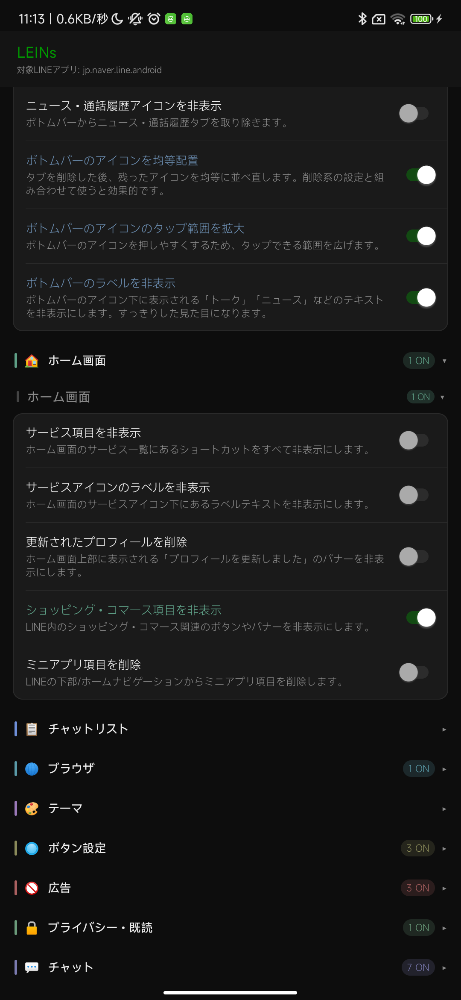

# 設定画面の使い方

[ホームへ戻る](../index.html) / [はじめてのLEINs](getting-started.md) / [用語集](glossary.md)

このページでは、LEINsの設定画面をどう開き、どのようにON/OFFするかを説明します。機能名の意味を知りたい場合は、各カテゴリページもあわせて見てください。

## まず覚えること

- LEINsの設定は、LINEの設定画面に追加されるLEINsボタンから開きます。
- スイッチをONにすると機能が有効、OFFにすると無効です。
- 変更後に反映されない場合は、LINEを再起動します。
- 自分の画面に項目が出ない場合は、プラン違い、APK違い、またはそのLINEバージョンでは未対応の可能性があります。
- 詳細ボタンがある項目は、スイッチをONにしたあとで追加設定を確認してください。

## 画面の構成

- LINEの設定内に追加されるLEINsボタンから設定画面を開きます。設定フォルダが未選択の場合は、フォルダ選択を求める案内が出ます。
- 最初の画面にはカテゴリカード、検索欄、LEINsテーマ、サポート、再起動ボタンが表示されます。
- カテゴリを開くと、小カテゴリごとにスイッチが並びます。スイッチを変更すると設定が保存され、必要な場合は再起動確認が表示されます。
- 一部の項目は親子関係があります。親スイッチがOFFのとき、子項目は設定画面上で無効状態になります。
- 詳細設定がある機能では、同じ小カテゴリ内に青い詳細ボタンが表示されます。親機能をONにしたときだけ表示される詳細ボタンもあります。
- UIスタイルは Android View / MIUI / Material 3 Expressive を切り替えられます。ボタン配置はヘッダー固定または移動可能にできます。

## 項目が見つからないとき

| 状況 | 確認すること |
|---|---|
| 設定名が見つからない | 検索欄に表示名の一部を入力します。例: 既読、通知、広告 |
| スイッチが押せない | 親機能がOFFになっていないか確認します。 |
| 詳細ボタンが出ない | 対象の親機能をONにしてから同じ小カテゴリを見直します。 |
| Wikiにあるのに画面に出ない | [プラン比較](editions.md) とAPKの種類を確認します。 |
| ONにしても変わらない | LINEを再起動し、必要なら端末も再起動します。 |

## 親子関係

| 親機能 | 子機能 |
|---|---|
| 通知に画像を追加 | グループ通知、コピー操作追加、リアクション通知、既読ボタン、既読後の通知削除 |
| リンクを外部ブラウザで開く | ブラウザアプリで開く |
| 本体の発着信音を鳴らす | 着信音を停止する |
| ダークテーマをピュアダークにする | システムのダークモードと同期 |
| 既読確認 | 新しい表示形式、自分の送信メッセージのみ表示、既読データ削除、データベース更新 |

## 詳細設定ボタン

| カテゴリ | 表示条件 | ボタン名 | 開く内容 |
|---|---|---|---|
| チャット・メッセージ | 画像/動画の保存時のファイル名変更がON | 画像/動画の保存時のファイル名を変更 | 保存時のファイル名ルールを設定します |
| ボタン設定 | 常時表示 | ボタンの設定 | LEINsボタンの位置や余白を調整します |
| チャット・メッセージ | 固定チャットの並び順設定がON | 固定チャットの並び順を設定 | 固定チャットの表示順を編集します |
| チャット・メッセージ | アーカイブ設定がON | アーカイブ設定 | アーカイブ関連の表示や動作を設定します |
| チャット・メッセージ | 送信取消保護がON | 取り消されたメッセージのトークを変更する | 取り消されたメッセージの表示先を設定します |
| チャット・メッセージ | 自動返信がON | リプレイメッセージ編集 | 自動返信するメッセージを編集します |
| プライバシー・既読 | 既読送信の相手別設定がON | 既読送信の相手別設定 | 既読を送る相手を個別に設定します |
| プライバシー・既読 | ブロック監視がON | ブロック監視 | ブロック監視の対象を設定します |
| プライバシー・既読 | 常時表示 | チャットリスト未読カウントリセット | チャットリストの未読カウントをリセットします |
| 画面レイアウト・UI | ミニアプリ画面の項目非表示がON | ミニアプリの項目非表示設定 | ミニアプリ画面で隠す項目を選びます |
| 通知 | 特定グループの通知ミュートがON | ミュート中のグループ | 通知をミュートするグループを編集します |
| 通知 | 特定ユーザー/グループ以外の通知オフがON | 特定のユーザー名、グループ名のみ以外の通知をオフ | 通知を許可するユーザーやグループを設定します |
| バックアップ・復元 | 常時表示 | バックアップ | トーク履歴のバックアップを開始します |
| バックアップ・復元 | 常時表示 | 復元 | バックアップファイルを選んで復元します |
| バックアップ・復元 | 常時表示 | PC版_messageテーブルを復元 | PC版のメッセージデータを選んで復元します |
| バックアップ・復元 | 常時表示 | チャットリストを復元 | チャットリストのバックアップを選んで復元します |
| バックアップ・復元 | 常時表示 | トーク画像フォルダのバックアップを開始 | トーク画像フォルダをバックアップします |
| バックアップ・復元 | 常時表示 | トーク画像のリストア | バックアップしたトーク画像を復元します |
| バックアップ・復元 | 常時表示 | Mid IDを取得 | 自分のMIDを確認します |
| 上級者向け | FCMトークン取得がON | FCMトークンを登録 | 通知用トークンを登録します |
| 上級者向け | 常時表示 | リクエストを改変 | 通信リクエストの改変設定を開きます |
| 上級者向け | LINE設定項目フィルターがON | LINE設定項目フィルター | LINE設定画面で表示する項目を編集します |
| 上級者向け | 常時表示 | レスポンスを改変 | 通信レスポンスの改変設定を開きます |
| 上級者向け | 常時表示 | 動的検出クラスをリセット | 自動検出された内部情報を初期化します |
| 上級者向け | 常時表示 | ライセンスキーをリセット | 保存済みのライセンスキーを初期化します |
| 上級者向け | 常時表示 | アクセストークン設定 | アクセストークンを設定します |
| 上級者向け | 常時表示 | 設定URIをリセット | 設定用URIを初期化します |
| 上級者向け | 常時表示 | LEINs内部のファイルをコピー | LEINsが使用するファイルを別の場所へコピーします |
| 上級者向け | 常時表示 | 寄付者一覧 | 寄付者一覧を表示します |
| 上級者向け | 常時表示 | 更新内容一覧 | 更新内容の一覧を表示します |
